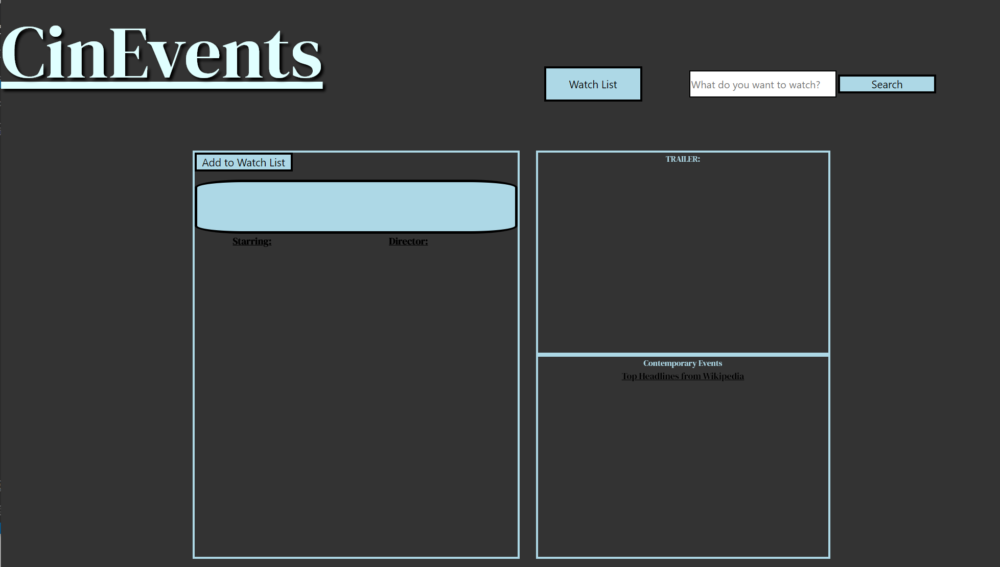
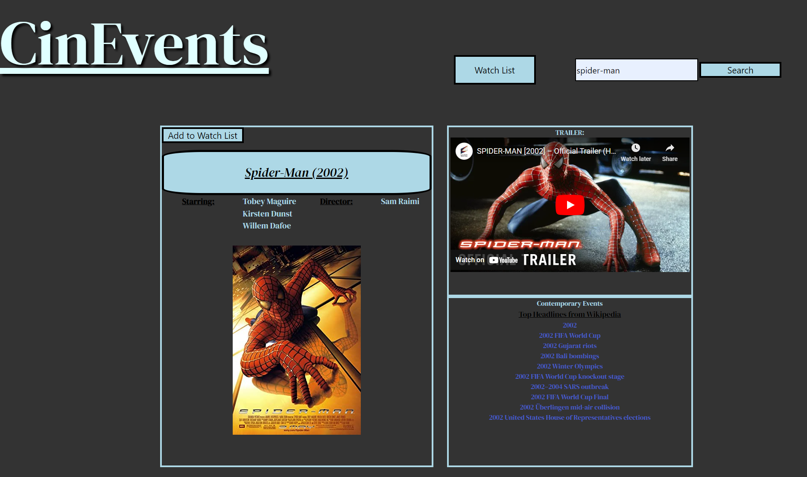
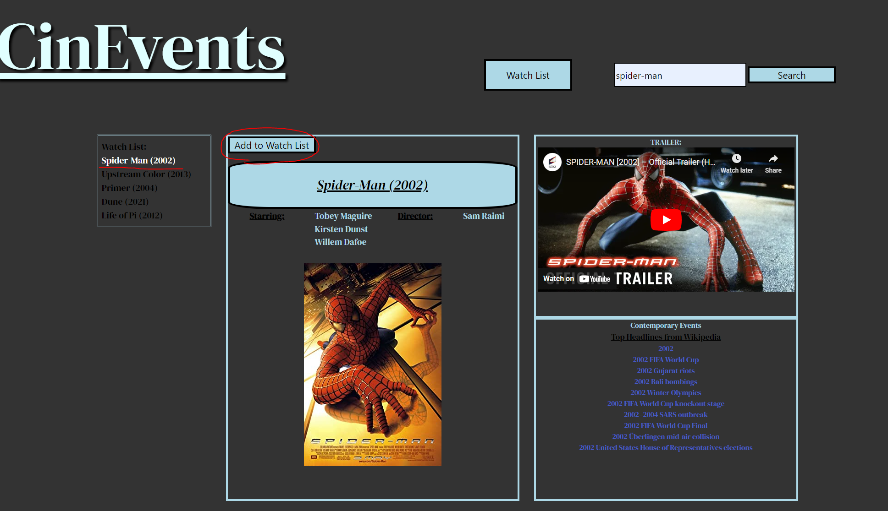
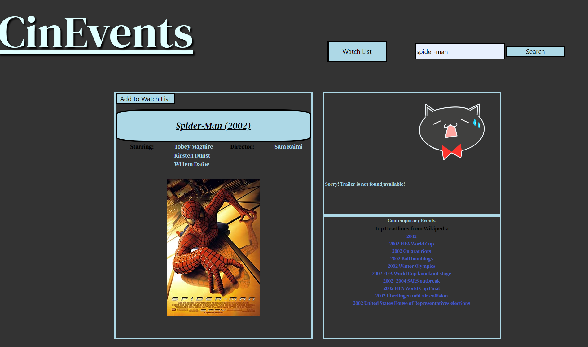

# UntitledGooseProject
This is a project for webpage 'CinEvents'.

CinEvents is a website to provide contemporaneous context for movies a user plans to watch


## Task for UntitledGooseProject

In this project, the task is to build and create a real-world front-end application with following requirements:

* Use a CSS framework other than Bootstrap.

* Building an interactive and responsive webpage.

* Use at least two server-side APIs.

* Does not use alerts, confirms, or prompts (use modals).

* Use client-side storage to store persistent data.

* Have a polished UI.


## User Story

```
AS AN avid film lover,
I WANT to be informed on the real-world historical context of the film
SO THAT I can be aware of world events at the time the movie was made. This can help a viewer to better understand thematic elements of a film

```

## Acceptance Criteria
```
GIVEN CinEvent webpage with form inputs
WHEN I search for a movie title
THEN I am presented with movie title, year, director(s), actors, video trailer, and comtemporary events those are related to its year 
WHEN I click 'Add to Watch List' button
THEN I can save that movie to watch list
WHEN I click 'Watch List' button
THEN I am presented with the list of added movies, and if I click the button again, watch list is hidden
```

## Description

* A link to deployed application: https://jjsmith32199.github.io/UntitledGooseProject/

The following images demonstrate the application functionality:



When user opens up the page, they can see the title on the top left, search bar and watch list button on the top right, and main body in the middle of the webpage. 



When user search movie, the page shows movie title, year, director(s), actors, video trailer, and comtemporary events those are related to its year.



User can add movies to their Watch List by clicking 'Add to Watch List' button above the movie's title. When user clicks 'Watch List' button next to the search bar, they can see the list of movies they have added. User can hide the watch list by clicking 'Watch List' button again. 

User can also search the result again by clicking the movie from the watch list.

(Added movie list is saved in user's browser local storage.)



When user does certain amount of searches, Youtube Trailer will not be available due to quota limit. Instead, it will display error image and message in trailer box. 


## How to use

* User can search movie information by seraching movie name from search bar next to 'Watch List' button. Search input is not uppercase/lowercase sensitive, however it is recommended that user inputs precise movie name without its released year for the accurate result. (ex: Spider-man (o),  Spider man (2002) (x) )

* User can add the searched movie to their watchlist by clicking 'Add to Watch List' button above the movie title. 

* User can see or hide their watch list by clicking 'Watch List' button next to the search bar. 

* User can re-search about movie by clicking movie name from Watch List.

* **Important Note: There is a quota limit for Youtube API.** After user doing certain amount of searches, Youtube trailer won't be available. (There will be error Code: 403, which is the request cannot be completed because it has exceeded quota.) If Youtube video trailer is not available due to server issue or fail to load due to quota limit, it will show error image and message saying, "Sorry! Trailer is not found/available!" 


## Directions for Future Development

* Indicator for how much Youtube quota has left **OR** implement Youtube trailer with no quota limit

* Optimization for Youtube API (Currently, Youtube trailer loads little slower than OMDB and Wikipedia data.)

* Pulling and displaying relevant news about actors and directors

* Include snippets of the articles along with the links.

* Include plot for specified movie.

* A few fixes on css style


## Credits

* Justin Smith[@jjsmith32199](https://github.com/jjsmith32199)

* Christopher Hughey[@eddercoppen](https://github.com/eddercoppen)

* Taeyoung Park[@taeyoungP](https://github.com/taeyoungP)

* Jonathan Aguilar[@aguilarj5](https://github.com/jjsmith32199)


> * OMDB API: https://www.omdbapi.com/

> * Youtube API: https://developers.google.com/youtube/v3/docs/search/list  |  How to utilize Youtube API, referenced from: https://stackoverflow.com/questions/18953499/youtube-api-to-fetch-all-videos-on-a-channel 

> * Wikipedia API: https://www.mediawiki.org/wiki/API:Main_page 

> * CSS Framework used for this project: Bulma, https://bulma.io/documentation/overview/start/ 

> * Code to move item in the array to end of the list: https://stackoverflow.com/questions/24909371/move-item-in-array-to-last-position

> * How to create Modal Box, referenced from: https://www.w3schools.com/howto/howto_css_modals.asp 

- - -